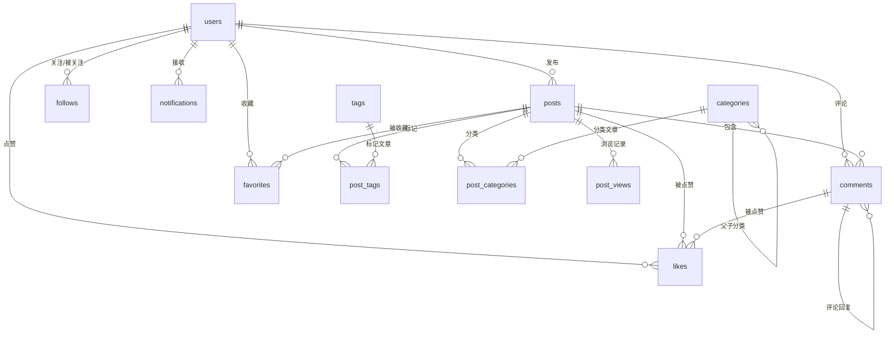

# 博客数据库设计文档

## 📊 数据库概览

本设计基于 PostgreSQL，为 IT 技术社区博客系统提供完整的数据支持。

### 核心特性
- ✅ 使用 UUID 作为主键，避免 ID 冲突
- ✅ 完整的索引优化，提升查询性能
- ✅ 软删除支持，数据可恢复
- ✅ 审计字段（created_at, updated_at）
- ✅ 自动更新时间戳触发器
- ✅ 外键约束保证数据完整性

---

## 🗂️ 数据库表结构

### 1. 用户管理

#### users（用户表）
存储用户基本信息和认证数据

| 字段 | 类型 | 说明 |
|------|------|------|
| id | UUID | 主键 |
| username | VARCHAR(50) | 用户名（唯一） |
| email | VARCHAR(255) | 邮箱（唯一） |
| phone | VARCHAR(20) | 手机号（唯一） |
| password_hash | VARCHAR(255) | 密码哈希 |
| avatar_url | VARCHAR(500) | 头像 URL |
| nickname | VARCHAR(100) | 昵称 |
| bio | TEXT | 个人简介 |
| role | VARCHAR(20) | 角色：user, admin, moderator |
| followers_count | INTEGER | 粉丝数 |
| following_count | INTEGER | 关注数 |
| posts_count | INTEGER | 文章数 |

#### user_sessions（用户会话表）
管理用户登录会话和 Token

---

### 2. 内容管理

#### posts（文章表）
存储博客文章内容和元数据

| 关键字段 | 说明 |
|---------|------|
| title | 文章标题 |
| slug | URL 友好的标识符（如：`how-to-use-blazor`） |
| content | 文章正文（支持 Markdown） |
| summary | 文章摘要 |
| status | 状态：draft（草稿）、published（已发布）、archived（归档） |
| visibility | 可见性：public、private、unlisted |
| is_featured | 是否为精选文章 |
| views_count | 浏览量 |
| likes_count | 点赞数 |
| comments_count | 评论数 |

#### categories（分类表）
支持层级分类（parent_id 实现父子关系）

#### tags（标签表）
标签系统，支持多标签

#### post_categories（文章分类关联表）
多对多关系：一篇文章可属于多个分类

#### post_tags（文章标签关联表）
多对多关系：一篇文章可有多个标签

---

### 3. 互动功能

#### comments（评论表）
支持多级评论回复（parent_id 实现评论树）

| 功能 | 实现 |
|------|------|
| 评论回复 | parent_id 外键引用自身 |
| 置顶评论 | is_pinned 字段 |
| 评论审核 | status 字段（published/pending/rejected） |

#### likes（点赞表）
通用点赞系统，支持文章和评论点赞

```sql
target_type: 'post' 或 'comment'
target_id: 对应的 post_id 或 comment_id
```

#### favorites（收藏表）
用户收藏文章功能

#### follows（关注表）
用户之间的关注关系

```sql
follower_id: 关注者
following_id: 被关注者
```

---

### 4. 统计分析

#### post_views（文章浏览历史）
记录每次文章浏览，支持：
- 用户浏览历史（已登录用户）
- IP 统计（未登录用户）
- User-Agent 分析

#### notifications（通知表）
系统通知功能

| 通知类型 | 说明 |
|---------|------|
| comment | 新评论通知 |
| like | 点赞通知 |
| follow | 关注通知 |
| mention | @提及通知 |
| system | 系统通知 |

---

## 🔗 表关系图



---

## 📈 核心功能支持

### ✅ 用户系统
- [x] 用户注册/登录
- [x] 手机号/邮箱验证
- [x] 角色权限管理
- [x] 用户关注系统
- [x] 用户统计数据

### ✅ 文章系统
- [x] 文章发布/编辑/删除
- [x] 草稿功能
- [x] 分类和标签
- [x] SEO 优化字段
- [x] 精选文章
- [x] 转载标记

### ✅ 互动系统
- [x] 评论和回复
- [x] 点赞功能
- [x] 收藏功能
- [x] 浏览统计
- [x] 消息通知

### ✅ 数据分析
- [x] 文章浏览分析
- [x] 用户行为跟踪
- [x] 统计数据缓存

---

## 🚀 使用指南

### 1. 创建数据库

```bash
# 创建数据库
createdb blazor_blog

# 连接数据库
psql -d blazor_blog

# 执行 schema
\i database_schema.sql
```

### 2. 配置连接字符串（.NET）

```json
{
  "ConnectionStrings": {
    "DefaultConnection": "Host=localhost;Database=blazor_blog;Username=your_user;Password=your_password"
  }
}
```

### 3. 安装 Npgsql（EF Core Provider）

```bash
dotnet add package Npgsql.EntityFrameworkCore.PostgreSQL
dotnet add package Microsoft.EntityFrameworkCore.Design
```

---

## 🔧 性能优化建议

### 索引策略
- ✅ 已为常用查询字段创建索引
- ✅ 外键字段自动索引
- ✅ 排序字段（created_at DESC）索引

### 查询优化
```sql
-- 使用索引查询最新文章
SELECT * FROM posts 
WHERE status = 'published' 
ORDER BY published_at DESC 
LIMIT 10;

-- 使用标签查询文章
SELECT p.* FROM posts p
INNER JOIN post_tags pt ON p.id = pt.post_id
INNER JOIN tags t ON pt.tag_id = t.id
WHERE t.slug = 'blazor';
```

### 分页查询
```sql
-- 游标分页（推荐）
SELECT * FROM posts 
WHERE published_at < '2024-01-01' 
ORDER BY published_at DESC 
LIMIT 20;
```

---

## 🛡️ 安全建议

1. **密码存储**：使用 BCrypt 或 Argon2 哈希
2. **SQL 注入**：使用参数化查询
3. **权限控制**：数据库用户最小权限原则
4. **备份策略**：定期备份数据库
5. **敏感数据**：对 password_hash、token 等字段加密存储

---

## 📝 迁移和演进

本设计支持渐进式开发：

1. **第一阶段**：用户 + 文章 + 分类/标签
2. **第二阶段**：评论 + 点赞 + 收藏
3. **第三阶段**：关注 + 通知 + 统计

可根据实际需求逐步实现各个功能模块。
